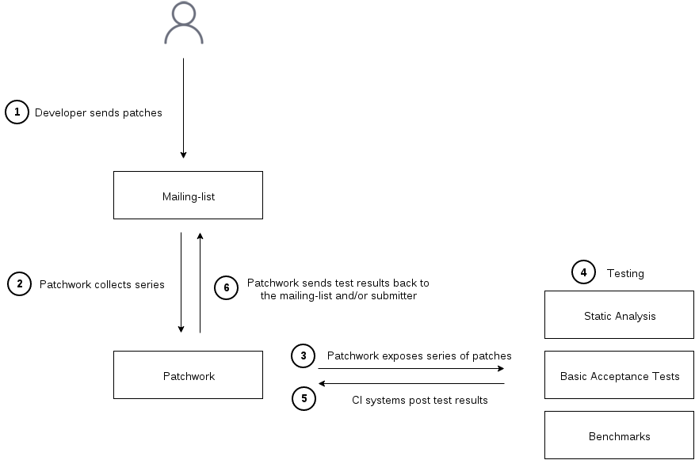

Testing with Patchwork
======================

Patchwork can be used in conjunction with tests suites to build a |CI| system.

Flow
----

Patches sent to the mailing list are grouped into *series* by Patchwork which,
then, exposes *events* corresponding to the mailing-list activity. Listening to
those *events*, one or more testing infrastructure(s) can retrieve the patches,
test them and post test results back to Patchwork to display them in the web
|UI|.  Optionally, Patchwork can send those test results back to the user
and/or mailing-list.

The following diagram describes that flow:

Series and Revisions
~~~~~~~~~~~~~~~~~~~~

Details about steps **1** and **2** can be found in :ref:`submitting-patches`.

Polling for events
~~~~~~~~~~~~~~~~~~

Step **3** is Patchwork exposing new series and new series revisions appearing on
the mailing list through the ``series-new-revision`` :ref:`event <rest-events>`.
This event is created when Patchwork has seen all patches that are part of a
new series/revision, so the API user can safely start processing the new series
as soon as they notice the new event, which, for now, is done polling the
:http:get:`/events/</api/1.0/projects/(string: linkname)/events/>` entry point.

To poll for new events, the user can use the ``since`` :http:method:`get`
parameter to ask for events since the last query. The time stamp to give to
that ``since`` parameter is the ``event_time`` of the last event seen.

Testing
~~~~~~~

Step **4** is, of course, where the testing happens. A mbox file of the series to
test can be retrieved with the
:http:get:`/mbox/</api/1.0/series/(int: series_id)/revisions/(int: version)/mbox/>`
revision method.

Test results
~~~~~~~~~~~~

Once done, results are posted back to Patchwork in step **5** with the
:http:post:`/test-results/</api/1.0/series/(int: series_id)/revisions/(int: version)/test-results/>` entry point.

One note on the intention behind the ``pending`` state: if running the test(s)
takes a long time, it's a good idea to mark the test results as ``pending`` as
soon as the ``series-new-revision`` event has been detected to indicate to the
user their patches have been picked up for testing.

Email reports
~~~~~~~~~~~~~

Finally, step **6**, the test results can be communicated back by mail to the
submitter. By default, Patchwork will not send any email, that's to allow test
scripts authors to develop without the risk of sending confusing emails to
people.

The test result emailing is configurable per test, identified by a unique tuple
(``project``, ``test_name``). That configuration is done using the Django
administration interface. The first parameter to configure is the email
recipient(s):

**none**
  No test result email should be sent out (default).

**submitter**
  Test result emails are sent to the patch submitter.

**mailing list**
  Test result emails are sent to the patch submitter with the project
  mailing-list in Cc.

**recipient list**
  Test result emails are sent to the list of email addresses specified in the
  ``Mail To list`` field.

The ``Mail To list`` and ``Mail Cc list`` are list of addresses that will be
appended to the ``To:`` and ``Cc:`` fields.

When the test is configured to send emails, the *when to send* can be tweaked
as well:

**always**
  Always send an email, disregarding the status of the test result.

**on warning/failure**
  Only send an email when the test has some warnings or errors.

**on failure**
  Only send an email when the test has some errors.

|git-pw| helper commands
------------------------

To interact with Patchwork, the REST API can be used directly with any language
and an HTTP library. For python, requests_ is a winning choice and I'd have a
look at the `git-pw source code`__.

:ref:`git-pw` also provides a couple of commands that can help with writing
test scripts without resorting to using the REST API.

.. __: https://gitlab.freedesktop.org/patchwork-fdo/patchwork-fdo/raw/master/git-pw/git-pw

|git pw poll-events|
~~~~~~~~~~~~~~~~~~~~

|git pw poll-events| will print events since the last invocation of this
command. The output is one event per line, oldest event first.
:command:`poll-events` stores the time stamp of the last event seen in a file
called :file:`.git-pw.$project.poll.timestamp`.

``--since`` can be used to override the last seen time stamp and ask for all the
events since a specific date::

    $ git pw poll-events --since=2016-02-12
    {"series": 3324, "parameters": {"revision": 1}, "name": "series-new-revision", ... }
    {"series": 3304, "parameters": {"revision": 3}, "name": "series-new-revision", ... }
    {"series": 3072, "parameters": {"revision": 2}, "name": "series-new-revision", ... }
    {"series": 3344, "parameters": {"revision": 1}, "name": "series-new-revision", ... }

As shown, |git pw poll-events| prints JSON objects on stdout. Its intended
usage is as input to a filter that would take each event one at a time and do
something with it, test a new revision for instance.

As a quick example of the above, to print the list of series created or updated
since a specific date (we need to use ``--name`` to select that type of event
only), a simple filter can be written:

.. code-block:: python

   #!/bin/python
   import fileinput
   import json

   for line in fileinput.input():
       event = json.loads(line)
       series = event['series']
       revision = event['parameters']['revision']
       print("series %d (rev %d)" % (series, revision))

Which gives::

    $ git pw poll-events --name=series-new-revision --since=2016-02-12 | ./show-series
    series 3324 (rev 1)
    series 3304 (rev 3)
    series 3072 (rev 2)
    series 3344 (rev 1)

|git pw post-result|
~~~~~~~~~~~~~~~~~~~~

The other side of the patchwork interaction with testing is sending test
results back. Here as well |git-pw| provides a command to simplify the process.
Remember it's always possible to directly use the REST API.

No need to repeat what's written in the
:http:post:`/test-results/</api/1.0/series/(int: series_id)/revisions/(int: version)/test-results/>` documentation here. Just a couple of examples, setting
a test result as pending::

    $ git pw post-result 3324 checkpatch.pl pending

And posting the final results::

    $ git pw post-result 3324 checkpatch.pl failure --summary-from-file results.txt

Example: running checkpatch.pl on incoming series
-------------------------------------------------

A slightly longer example can be found in the Patchwork repository, in
`docs/examples/testing-checkpatch.py`__. This script will take
``series-new-revision`` events as input, as offered by |git pw poll-events| and
run checkpatch.pl on the incoming series. The main complexity beyond what has
been explained in this document is that checkpatch.pl is run on each patch of
the series individually (by looping on all mails of the series mbox) and the
checkpatch.pl output is aggregated to be sent in the ``summary`` field of the
test result.

Putting the following line in a cron entry should be enough to run
checkpatch.pl on each new series::

    git pw poll-events | testing-checkpatch.pl

There are a few improvements to make to have a nicer solution: for instance,
one could make sure that the checkpatch.pl script is up-to-date by updating the
Linux checkout before running the test.

.. __: https://gitlab.freedesktop.org/patchwork-fdo/patchwork-fdo/blob/master/docs/examples/testing-checkpatch.py

.. include:: symbols
